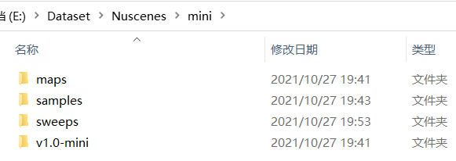

## 数据集介绍

 在nuScenes官网注册一个账号下载数据集，完整数据集包含3个部分：

* **Mini** ：从训练/验证集抽取10个场景组成，包含完整的原始数据和标注信息，主要用于数据集的熟悉；
* **TrainVal** ：训练/验证集，包含850个场景，其中700个训练场景，150个验证场景
* **Test** ：测试集，包含150个场景，不包含标注数据。

 下载好的数据集包含4个文件夹：

* **maps** ：地图数据，四张地图对应着4个数据采集地点
* **samples** ：带有标注信息的关键帧数据，训练主要用这部分数据
* **sweeps** ：完整时序数据，不带有标注信息，一般用于跟踪任务
* **v1.0-version** :存有数据依赖关系、标注信息、标定参数的各种json文件

官网的关系图进行了归纳和精简。

  总的来说，nuScenes数据集分为mini、trainval、test三个部分，每个部分的数据结构完全相同，可以分成scene、sample、sample_data三个层级，数据访问通过token（可以理解为指针）来实现：

scene：是一段约20s的视频片段，由于关键帧采样频率为2Hz，所以每个scene大约包含40个关键帧，可以通过scene中的pre和next来访问上下相邻的sample
sample：对应着一个关键帧数据，存储了相机、激光雷达、毫米波雷达的**token**信息，mini和trainval数据集中的sample还存储了标注信息的token
sample_data：sample中存储的token指向的数据，即我们最终真正关心的信息，比如图片路径、位姿数据、传感器标定结果、标注目标的3d信息等。获取到这些信息就可以开始训练模型了。

## 参考

原文链接：https://blog.csdn.net/qq_16137569/article/details/121066977
